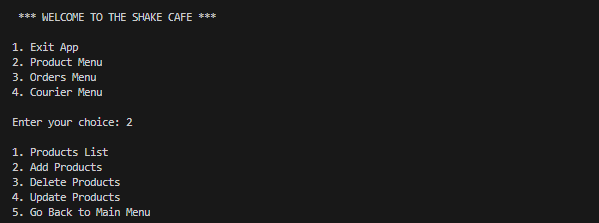

# Prototype-Cafe-App

## Project Background
```py
I was commissioned to develop a prototype Cafe App tailored for a dynamic new pop-up cafe establishment. Crafted using Python 3, the app features a streamlined CLI menu system. It empowers users to effortlessly manage various categories such as Products, Orders, and Couriers, offering functionalities to view, add, delete, and update data. Seamlessly integrated with a MySQL database, the app ensures robust data persistence and reliability. 
```

## Client Requirments 
```py
The clint had 7 requirements within the template:

1. I require a comprehensive catalog of products and couriers to be maintained within the system.

2. Upon receiving a new order from a customer, the system must seamlessly integrate it into the database.

3. Flexibility is essential, enabling the user to update the status of orders efficiently, whether they are being prepared, out for delivery, already delivered or cancelled.

4. Crucially, all data must persist even after exiting the application, ensuring no loss of critical information.

5. Upon launching the application, it should automatically load all previously persisted data, ensuring a seamless user experience.

6. Rigorous testing and validation procedures are imperative to guarantee the reliability and functionality of the application, ensuring it meets the highest standards of performance.

7. Regular software updates are essential to address any bugs, enhance features, and maintain optimal performance, demonstrating a commitment to continuous improvement and customer satisfaction.
```

## Design Decision

### Cafe-App
```py
Included options for each menu to view, add delete and update Products, Orders and Couriers.
```

](Images/CLI.png)

```py
Moved persisting data from csv files into a MySQL Database.
```


```py
Added error checking functionality for faulty inputs.
```


```py
Added unit tests for the error checking functionality.
```
![!\[alt text\]](<Images/Unit test.png>)


